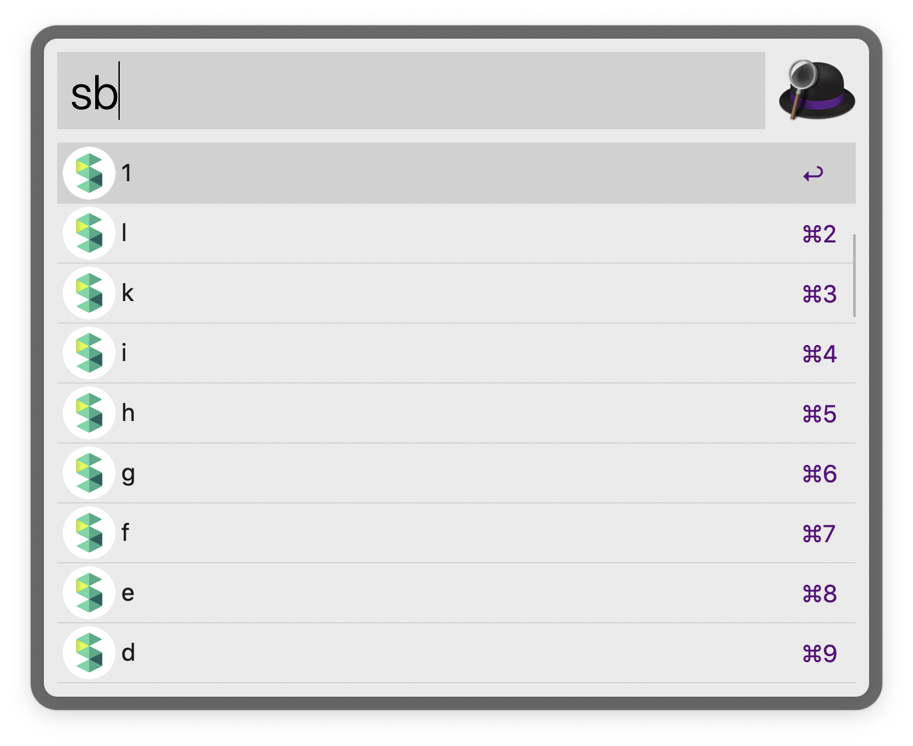

# alfred-scrapbox-listview

## Usage

+ Typing "sb" will fetch a list of scrapbox items.

```
$ sb [keyword]
```



## Installation

+ Depended on [jq](https://stedolan.github.io/jq/) command.
+ Import this `.alfredworkflow` file.
    + `projectId (required)` ... ex) ABC-XXX
    + `token (required)` ... ex) s%123456789ABC
    + `JQPATH (option)` ... ex) /usr/local/bin
 


## Note

Created by Alfred ver 4.1
