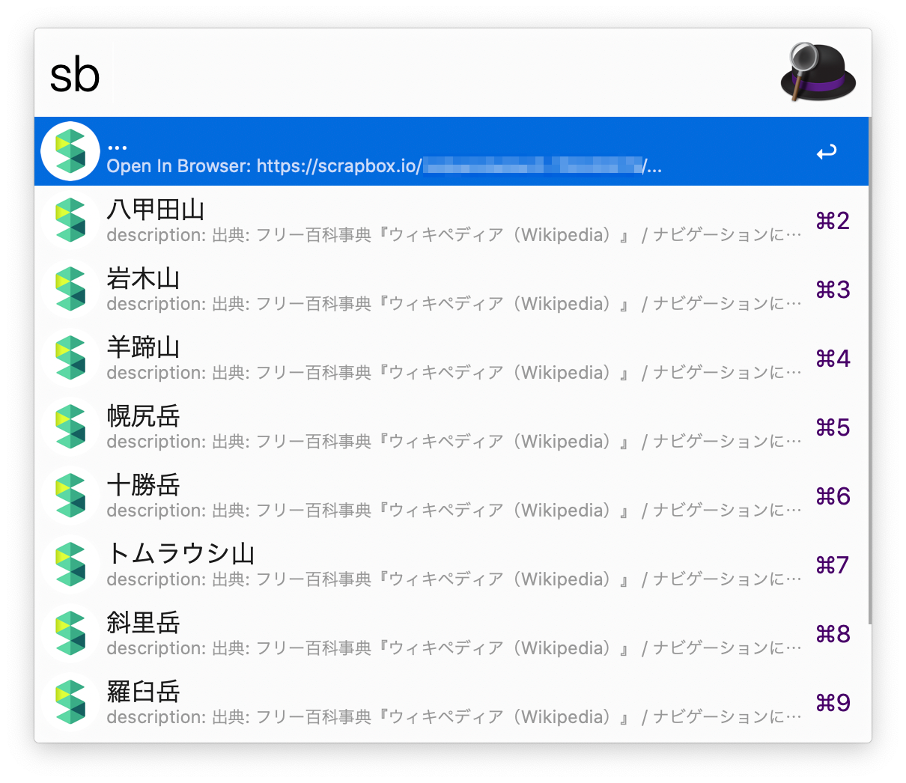
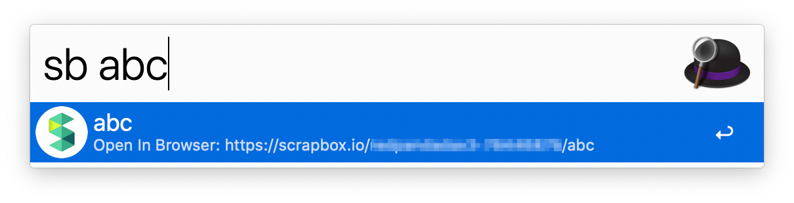
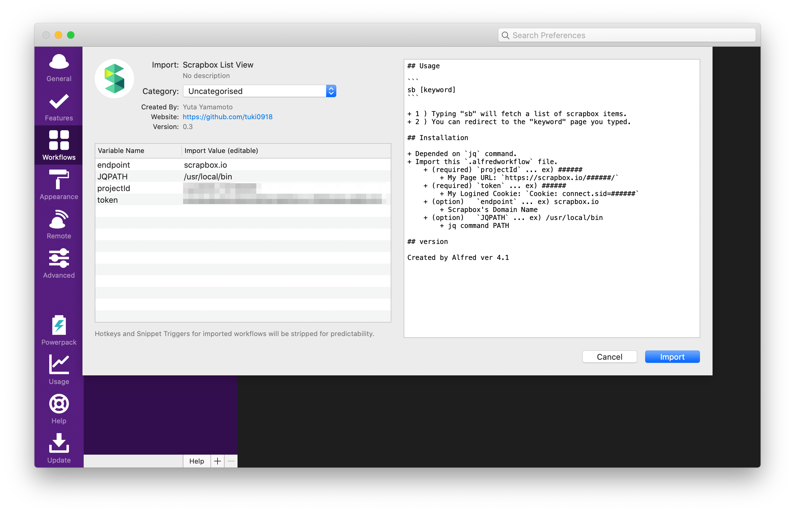
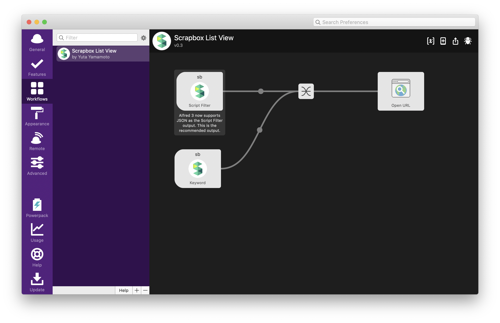

# alfred-scrapbox-listview

## Usage

```
sb [keyword]
```

+ 1 ) Typing "sb" will fetch a list of scrapbox items.
+ 2 ) You can redirect to the "keyword" page you typed.

1 )



2 )



## Installation

+ Depended on bash, [jq](https://stedolan.github.io/jq/) command.
+ Import this `.alfredworkflow` file.

| Variable Name | Required | Value | Description |
| ---- | :----: | ---- | ---- |
| projectId | v | ###### | My Page URL: `https://scrapbox.io/######/` |
| token | v | ###### | My Logined Cookie: `Cookie: connect.sid=######` |
| endpoint | _ | scrapbox.io | Scrapbox's Domain Name |
| JQPATH | _ | /usr/local/bin | jq command PATH |




## Note

Created by Alfred ver 4.1
